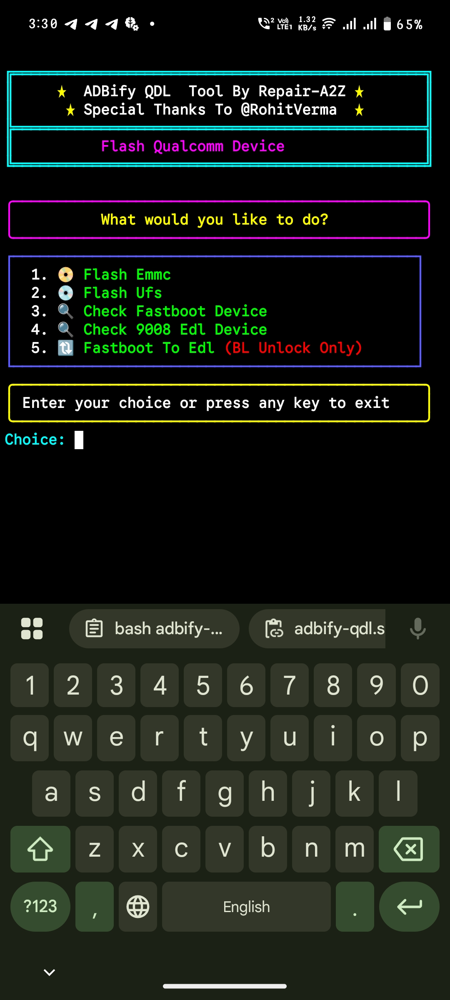

# ADBiFY-QDL
Flash Qualcomm Device Without PC Without Root in Simple Steps. QDL Tool Updated to letest source Now QDL Support 5 type storage (Nand/Emmc/nvme/ufs/spinor) also Speed improved, Flashing ui Chenge.


## installation :- 

```Install``` [ADBify](https://play.google.com/store/apps/details?id=com.rv882.adbify)```apk```

## File Locations
1. Create qdl-flash folder under internal storage
2. Download this repository zip file
3. extract repository zip file under qdl-flash folder
4. extract your flash file under qdl-flash folder

## Open ADBify app then exicute Given Commonds

```console
cd /storage/emulated/0/qdl-flash
```

## Run Tool
```console
bash adbify-qdl.sh
```
## Tool interface & usage
1. Here show all options emmc flash, ufs flash
2. Enter your storage type then paste file locations
3. you can also check otg connected device status
4. switch fastboot to edl mode without opening mobile (BL unlocked device only)

## Note :-
1. Download Your device firmware then extract it after extract Create ```qdl-flash``` folder in internal Storage.

2. Copy your all firmware file to ```qdl-flash``` folder.

```all firmware file Must be under qdl-flash folder```

```And qdl-flash folder under internal storage root```


# Credit :-
1. [@RohitVerma](https://github.com/RohitVerma882) For Adbify app and modify qdl
2. [Repair A2Z](https://youtube.com/@repaira2z) For Adbify-qdl script

## Subscribe My YouTube Channel 
[Repair A2Z](https://youtube.com/@repaira2z)
[Repair A2Z Mix](https://youtube.com/@repaira2zmix)
